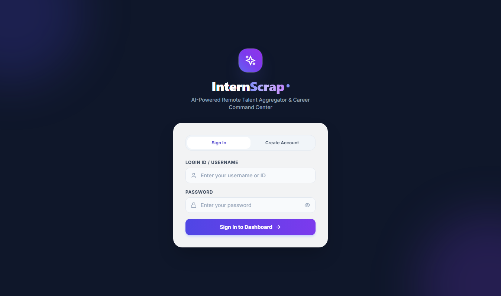
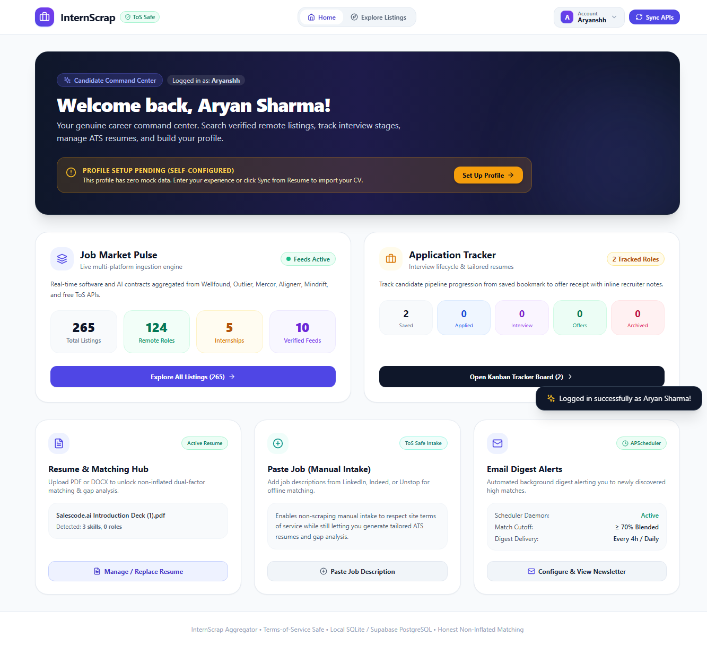
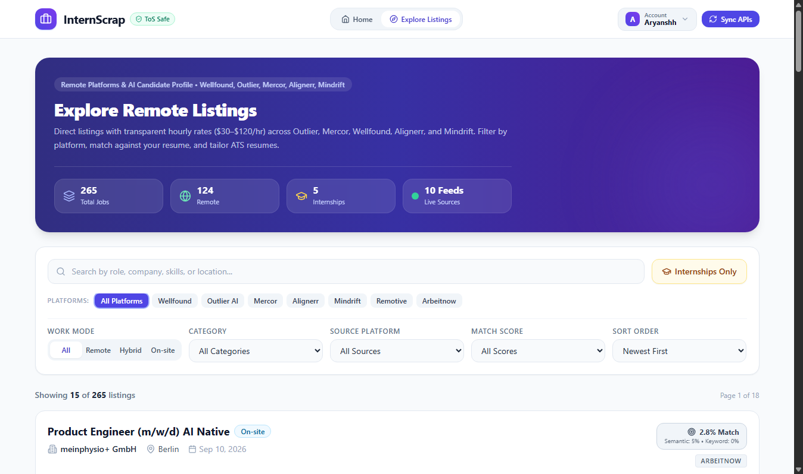
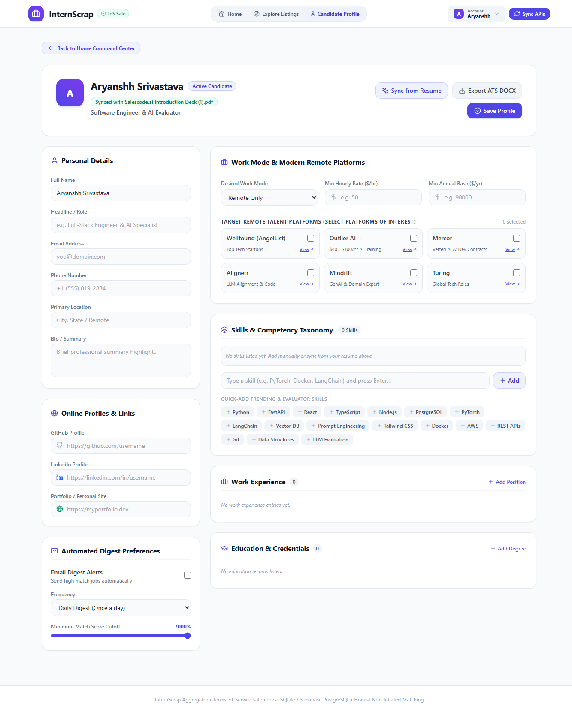

# InternScrap: Remote Talent Aggregator & Career Suite

> **An honest, Terms-of-Service safe job/internship aggregator, Wellfound-modeled candidate dossier, ATS-optimized resume tailor, and zero-fabrication auto applier.**

---

## Overview & Capabilities

**InternScrap** aggregates verified software engineering, AI alignment, data science, and internship listings across modern remote talent platforms and free, ToS-compliant APIs. 

Unlike traditional inflated scrapers, **InternScrap** enforces strict zero-fabrication guardrails, transparent compensation metadata (-/hr), authentic candidate dossier management modeled after Wellfound (AngelList Talent), and factual gap analysis against your verified resume.

### Platform Preview

| Dedicated Authentication Page (Login ID/Email & Pwd) | Unified Home Command Center Dashboard |
| :---: | :---: |
|  |  |

| Explore Remote Listings (Streamlined Header) | Blank Profile for Self-Setup (Aryanshh) |
| :---: | :---: |
|  |  |

| 5-Stage Kanban Application Tracker | Automated Background Email Digest |
| :---: | :---: |
|  |  |

---

## Key Features

### 1. Authentication & Candidate Dossier Onboarding
- **Create Account Flow**: Structured candidate onboarding capturing Full Name, Email, Username, Password with real-time strength meter, Primary Target Role, Desired Work Mode, and Years of Experience.
- **Dual Sign-In**: Login using either Username OR Email address with secure password verification.
- **Dedicated Authentication Portal**: Secure sign-in and account registration (POST /api/auth/login, POST /api/auth/register) with session token persistence.
- **Quick Demo Presets**: Instant one-click test logins (demo, Aryanshh, Nishtha).

### 2. Auto Applier & Wellfound Candidate Vault
- **Wellfound Profile Architecture**: Complete candidate vault modeled on AngelList Talent / Wellfound candidate profiles:
  - Identity & Socials (GitHub, LinkedIn, Portfolio, Wellfound, Twitter/X).
  - Work Preferences (Primary Role, Work Mode, Notice Period, Relocation, Minimum Annual Base, Hourly Minimum).
  - Skills with Tenure (structured {skill, years} records to accurately satisfy ATS tenure questions).
  - 100% Zero-Fabrication Personal Pitch and Proudest Achievement highlights.
  - Compliance & EEO standard defaults (decline-to-self-identify defaults).
- **Multi-Platform ATS Form Filler**: Pre-fills application forms for Greenhouse, Lever, Ashby, Workday, and standard custom job boards.
- **1-Click Job Board Queuing**: Queue jobs directly from Explore Listings cards or import saved jobs into the Auto-Applier launcher.

### 3. IIM 1-Page Resume Engine
- **3 Distinct Executive Themes**:
  - **Classic IIM Benchmark**: Pure black-and-white academic typography, single-column density, dense qualifications tables.
  - **Executive Modern**: Deep navy corporate headers, refined typography, elegant dividers.
  - **Technical Elite**: Technical monospace accents, clean slate borders, highlighted technical proficiencies.
- **1-Page Density Guarantee**: Strict single-page layout designed to pass top-tier recruitment screenings and ATS parsers.

### 4. Unified Home Command Center
- **Feature Hub**: Declutters the navigation bar by centralizing key platform modules into one executive dashboard:
  - **Job Market Pulse**: Live statistics across listings, remote roles, internships, and active platform feeds.
  - **Candidate Profile Setup**: Real-time setup status indicator, personal info, skills taxonomy, and direct DOCX export.
  - **Application Tracker**: 5-stage pipeline breakdown (Saved, Applied, Interviewing, Offer, Rejected).
  - **Resume & Matching Hub**: Synced resume metadata, detected skills, and one-click resume upload.
  - **Paste Job (Manual Intake)**: Offline job intake portal for LinkedIn, Indeed, or Unstop listings.
  - **Email Digest Alerts**: APScheduler daemon status, frequency, and newsletter viewer.

### 5. Multi-Source Remote Platform Ingestion
- **Wellfound (formerly AngelList Talent)**: Seed, Series A, and Y-Combinator startup engineering roles.
- **Outlier AI**: Frontier LLM training, data science, and reasoning evaluation (-/hr).
- **Mercor**: Vetted AI contracts and full-stack software development (-/hr).
- **Alignerr**: AI alignment, RLHF evaluation, and code correctness (-/hr).
- **Mindrift**: Generative AI code reviewing and prompt engineering (-/hr).
- **Free ToS-Safe APIs**: Remotive, Arbeitnow, Jobicy, RemoteOK.
- **Manual Intake Portal**: Paste job descriptions from external sources for offline matching without violating anti-scraping terms.

### 6. Honest Dual-Factor Matching Engine
- **Non-Inflated Scoring**: Blended composite of semantic similarity (55%) and exact technical keyword coverage (45%).
- **Factual Gap Analysis**: Explicitly highlights missing JD requirements without hallucinating candidate qualifications.
- **Algorithmic Transparency**: Clarifies scores as algorithmic estimates, not guaranteed outcomes.

---

## Architecture & Tech Stack

`
InternScrap/
├── backend/                  # FastAPI Application
│   ├── models/               # SQLAlchemy Models (Job, Resume, Application, UserProfile, User)
│   ├── routes/               # API Endpoints (auth, jobs, profile, resumes, tailoring, tracker, auto_apply)
│   ├── services/
│   │   ├── auto_applier.py   # Multi-Platform ATS Autofill Engine
│   │   ├── iim_resume_service.py # 1-Page IIM Resume Generator (Classic, Executive, Tech)
│   │   ├── ingestion/        # Feed Parsers (RemoteTalent, Remotive, Arbeitnow, Jobicy, RemoteOK)
│   │   ├── matching_engine.py# Semantic & Keyword Matching (SentenceTransformers)
│   │   ├── resume_parser.py  # PDF/DOCX Parser (pdfplumber & python-docx)
│   │   └── scheduler_service.py # APScheduler Background Task
│   └── database.py           # SQLite & PostgreSQL (Supabase/Railway/Render) Engine
├── frontend/                 # React 18 + Vite + TypeScript
│   ├── src/
│   │   ├── components/       # AutoApplierModal, LoginPage, CandidateProfile, JobCard, Header
│   │   ├── api/              # Axios API Client
│   │   └── types/            # TypeScript Interface Definitions
│   └── tailwind.config.js    # Modern SaaS Design System
└── tests/                    # Backend Automated Verification Suite
`

---

## Quickstart Guide

### Prerequisites
- **Python 3.11+**
- **Node.js 18+** and **npm**

### 1. Clone the Repository
`ash
git clone https://github.com/Aryanshh/InternScrap.git
cd InternScrap
`

### 2. Backend Setup
`ash
# Create and activate virtual environment
python -m venv venv
# Windows:
.env\Scriptsctivate
# macOS / Linux:
source venv/bin/activate

# Install dependencies
pip install -r backend/requirements.txt

# Start FastAPI backend (runs on http://127.0.0.1:8000)
uvicorn backend.main:app --reload --host 127.0.0.1 --port 8000
`

### 3. Frontend Setup
`ash
cd frontend

# Install npm packages
npm install

# Start Vite dev server (runs on http://127.0.0.1:5173)
npm run dev
`

Visit **http://127.0.0.1:5173** in your browser to start exploring.

---

## Testing

Run backend tests:
`ash
pytest tests/ -v
`

Test remote platforms and profile endpoints:
`ash
python tests/test_phase2.py
python tests/test_phase3.py
`

---

## License

This project is licensed under the [MIT License](LICENSE).
