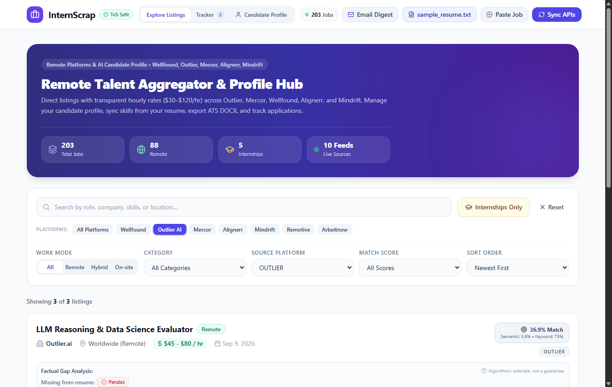
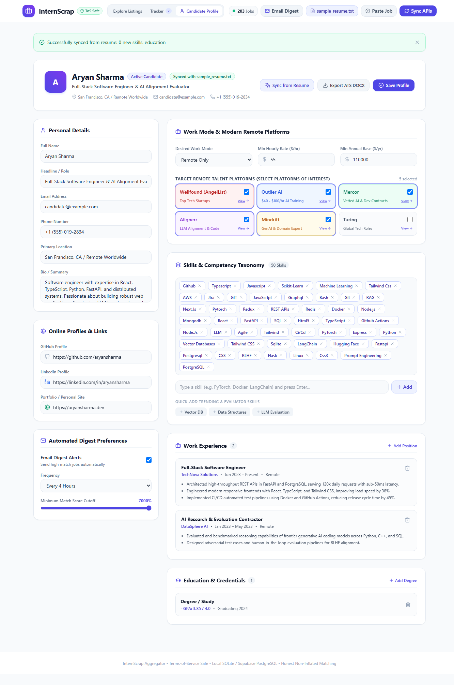
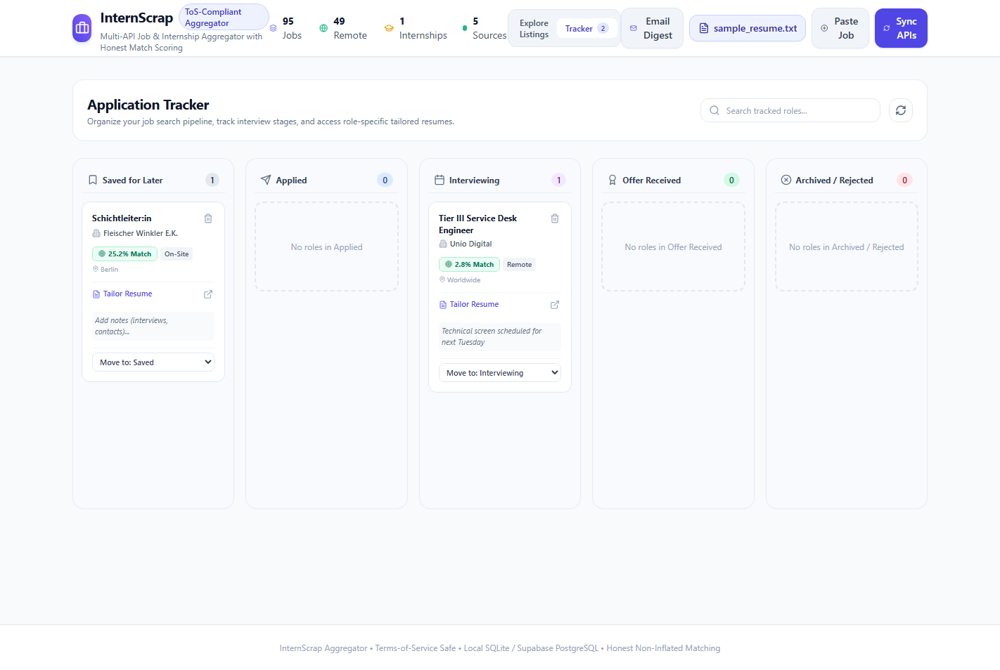
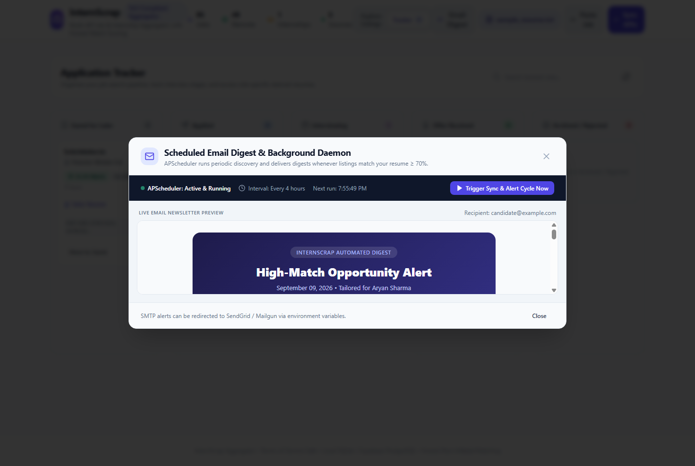

# 🚀 InternScrap: Remote Talent Aggregator & AI Career Suite

> **An honest, Terms-of-Service safe job/internship aggregator, AI-driven candidate profile manager, and ATS-optimized resume tailor.**

[](https://fastapi.tiangolo.com)
[](https://react.dev)
[](https://www.typescriptlang.org/)
[](https://vitejs.dev)
[](https://tailwindcss.com)
[](https://opensource.org/licenses/MIT)

---

## 🌟 Overview & Capabilities

**InternScrap** aggregates verified software engineering, AI alignment, data science, and internship listings across modern remote talent platforms and free, ToS-compliant APIs. 

Unlike traditional inflated scrapers, **InternScrap** enforces strict zero-fabrication guardrails, transparent compensation metadata ($30–$120/hr), and factual gap analysis against your verified resume.

### 🖼️ Live Platform Preview

| Remote Platform Listings ($30–$120/hr) | Full Candidate Profile & ATS Export |
| :---: | :---: |
|  |  |

| 5-Stage Kanban Application Tracker | Automated Background Email Digest |
| :---: | :---: |
|  |  |

---

## ✨ Key Features

### 1. 🌐 Multi-Source Remote Platform Ingestion
- **Wellfound (formerly AngelList Talent)**: Seed, Series A, and Y-Combinator startup engineering roles.
- **Outlier AI**: Frontier LLM training, data science, and reasoning evaluation ($40–$100/hr).
- **Mercor**: Vetted AI contracts and full-stack software development ($60–$120/hr).
- **Alignerr**: AI alignment, RLHF evaluation, and code correctness ($45–$90/hr).
- **Mindrift**: Generative AI code reviewing and prompt engineering ($35–$75/hr).
- **Free ToS-Safe APIs**: Remotive, Arbeitnow, Jobicy, RemoteOK.
- **Manual Intake Portal**: Paste job descriptions from LinkedIn, Indeed, or Unstop for offline matching without violating anti-scraping terms.

### 2. 👤 Candidate Profile & Skills Taxonomy
- **Unified Profile Hub**: Contact info, headline, primary location, bio, GitHub, LinkedIn, and personal portfolio site.
- **Interactive Platform Badges**: Multi-select target platforms with 1-click `"View →"` filter shortcuts.
- **Skills Taxonomy**: Tag cloud with removable chips, custom skill adder, and quick-add pills for trending technologies (`Vector DB`, `LLM Evaluation`, `LangChain`, `Docker`).
- **Work Experience & Education**: Card-based career timeline with inline creation forms and bullet point management.
- **Resume Synchronization**: One-click sync from active uploaded PDF/DOCX resumes (`POST /api/profile/sync-from-resume`).
- **ATS DOCX Resume Export**: Generates compliant `.docx` resumes with standard 0.75" margins and executive typography (`GET /api/profile/export-docx`).

### 3. 🎯 Honest Dual-Factor Matching Engine
- **Non-Inflated Scoring**: Blended composite of semantic similarity ($55\%$) and exact technical keyword coverage ($45\%$).
- **Factual Gap Analysis**: Explicitly highlights missing JD requirements without hallucinating candidate qualifications.
- **Algorithmic Transparency Disclaimer**: Clarifies scores as algorithmic estimates, not guaranteed outcomes.

### 4. 📄 ATS Resume Tailoring & Visual Audit Diff
- Reorganizes real bullet points and promotes matching skills to the top.
- **Zero-Fabrication Guardrail**: Never invents skills, credentials, or metrics. Unmatched JD requirements are explicitly surfaced in an audit diff.
- Instant `.docx` download formatted for ATS scanners.

### 5. 📋 Kanban Application Tracker & Scheduled Email Digest
- **5-Stage Pipeline**: Track applications across `Saved`, `Applied`, `Interviewing`, `Offer`, and `Rejected`.
- **APScheduler Service**: Automated background digest evaluating high-match opportunities and generating responsive HTML emails.

---

## 🛠️ Architecture & Tech Stack

```
InternScrap/
├── backend/                  # FastAPI Application
│   ├── models/               # SQLAlchemy Models (Job, Resume, Application, UserProfile, TailoredResume)
│   ├── routes/               # API Endpoints (jobs, profile, resumes, tailoring, tracker, scheduler)
│   ├── services/
│   │   ├── ingestion/        # Feed Parsers (RemoteTalent, Remotive, Arbeitnow, Jobicy, RemoteOK)
│   │   ├── matching_engine.py# Semantic & Keyword Matching (SentenceTransformers)
│   │   ├── resume_parser.py  # PDF/DOCX Parser (pdfplumber & python-docx)
│   │   ├── resume_generator.py# ATS-Optimized Word Docx Builder
│   │   └── scheduler_service.py # APScheduler Background Task
│   └── database.py           # SQLite & PostgreSQL (Supabase/Railway) Engine
├── frontend/                 # React 18 + Vite + TypeScript
│   ├── src/
│   │   ├── components/       # CandidateProfile, FilterBar, JobCard, ApplicationTracker, Header, Modals
│   │   ├── api/              # Axios API Client
│   │   └── types/            # TypeScript Interface Definitions
│   └── tailwind.config.js    # Modern SaaS Design System
└── tests/                    # Backend Automated Verification Suite
```

---

## ⚡ Quickstart Guide

### Prerequisites
- **Python 3.11+**
- **Node.js 18+** and **npm**

### 1. Clone the Repository
```bash
git clone https://github.com/Aryanshh/InternScrap.git
cd InternScrap
```

### 2. Backend Setup
```bash
# Create and activate virtual environment
python -m venv venv
# Windows:
.\venv\Scripts\activate
# macOS / Linux:
source venv/bin/activate

# Install dependencies
pip install -r backend/requirements.txt

# Start FastAPI backend (runs on http://127.0.0.1:8000)
uvicorn backend.main:app --reload --host 127.0.0.1 --port 8000
```

### 3. Frontend Setup
```bash
cd frontend

# Install npm packages
npm install

# Start Vite dev server (runs on http://127.0.0.1:5173)
npm run dev
```

Visit **`http://127.0.0.1:5173`** in your browser to start exploring!

---

## 🧪 Testing

Run backend tests:
```bash
pytest tests/ -v
```

Test remote platforms and profile endpoints:
```bash
python tests/test_phase2.py
python tests/test_phase3.py
```

---

## 📄 License

This project is licensed under the [MIT License](LICENSE).
